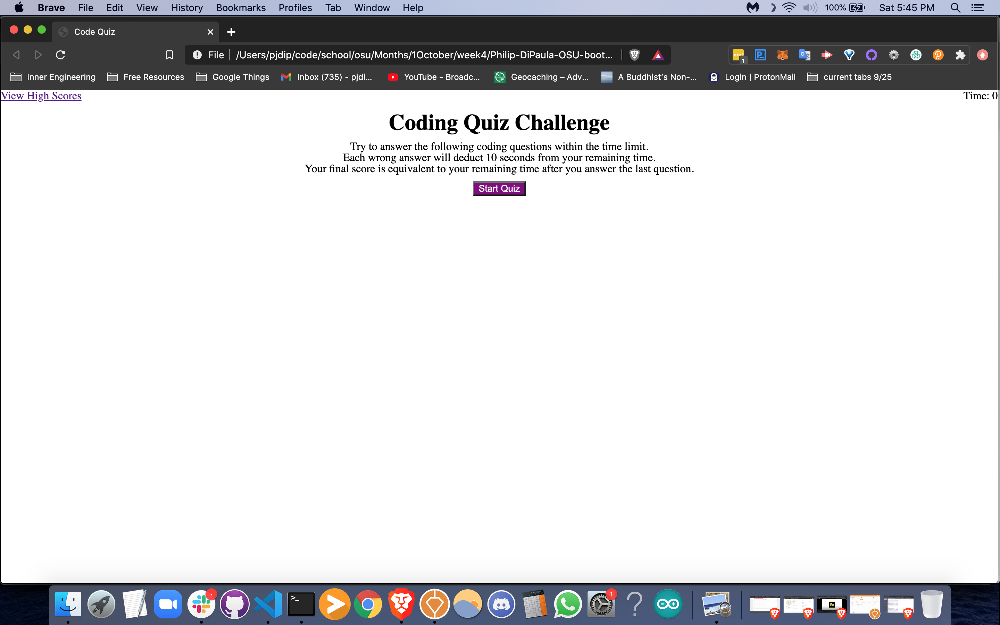
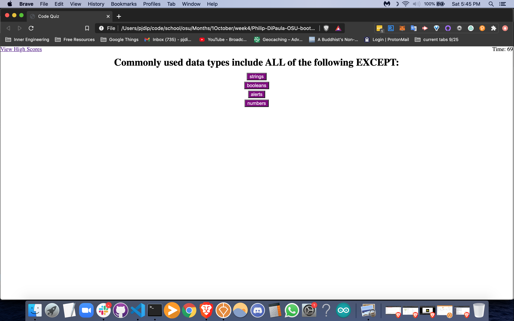
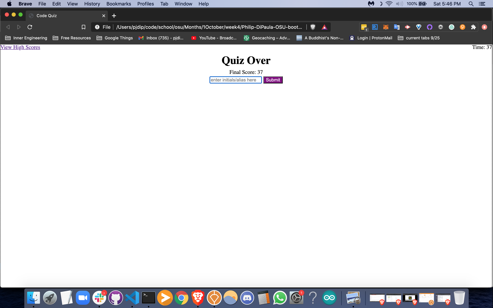
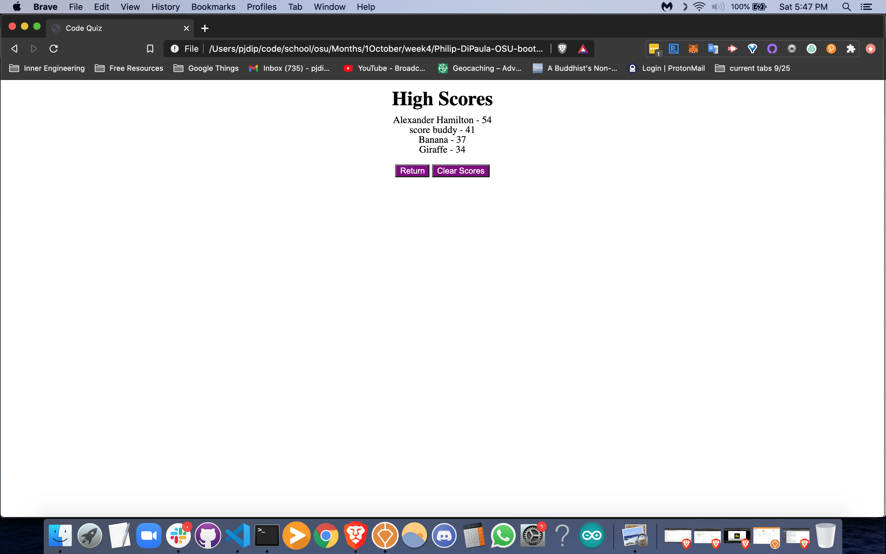

# Philip-DiPaula-OSU-bootcamp-hwk4

## These are the files for the fourth OSU Web Development Bootcamp Homework Assignment

Here is a [link](https://pjdip.github.io/Philip-DiPaula-OSU-bootcamp-hwk4/) to the live page :D

The goal of this assignment was to create a simple quiz using javascript/html/css. The quiz is timed and consists of several multiple choice questions. At the end of the quiz the user can input an alias and have their score saved and displayed in a high scores page.

* [Installation](#installation)
* [Usage](#usage)
* [Credits](#credits)
* [Badges](#badges)
* [License](#license)

## Installation

The only thing you will need to have installed in order to run the index.html file is a functioning web browser. It should work with most versions of most browswers. I recommend the Brave browser, as you will be paid in the Basic Attention Token (BAT) for viewing ads, instead of being bombarded with ads and getting nothing for it.

## Usage 

In order to use this project, simply open the index.html in your favorite browser or open the link provided above. You will find the timer displayed in the upper right corner and a link to the high scores page in the upper left corner. Read the directions and press the start button when you are ready. The time will initiate and you will be presented with some questions. Every wrong answer will deduct 10 seconds from your time and the final time when you complete the quiz will represent your score. When the time is up or you have finished answering all the questions, you will be directed to input your alias. Once you click submit, your score will be stored and you will be sent to the high scores page. From here you can view the high scores, clear the high scores (if you so choose), and return to the start of the quiz.

## Credits

Thanks to Mozilla Developer Network for clarification on dealing with [storage](https://developer.mozilla.org/en-US/docs/Web/API/Storage/removeItem), the CSS [display property](https://developer.mozilla.org/en-US/docs/Web/CSS/display), working with [objects](https://developer.mozilla.org/en-US/docs/Web/JavaScript/Guide/Working_with_Objects), and [sorting arrays of objects](https://developer.mozilla.org/en-US/docs/Web/JavaScript/Reference/Global_Objects/Array/sort) based on their properties.

Thanks to stackoverflow for a simple code snippet to [remove all the child elements of a dom node](https://stackoverflow.com/questions/3955229/remove-all-child-elements-of-a-dom-node-in-javascript)

Thanks to thenewcode for some thoughts on [hiding elements](http://thenewcode.com/304/Four-Ways-to-Make-Elements-Disappear-and-Reappear)

Thanks to david walsh for help with [event delegation](https://davidwalsh.name/event-delegate)

Thanks to git documentation for help with [branching/merging](https://git-scm.com/book/en/v2/Git-Branching-Basic-Branching-and-Merging)

Special Thanks to [ChilledCow](https://www.youtube.com/channel/UCSJ4gkVC6NrvII8umztf0Ow) for providing chill lofi beats to code to

## Badges

## License

Licensed under the [GNU General Public License v3.0](https://choosealicense.com/licenses/gpl-3.0/)

---